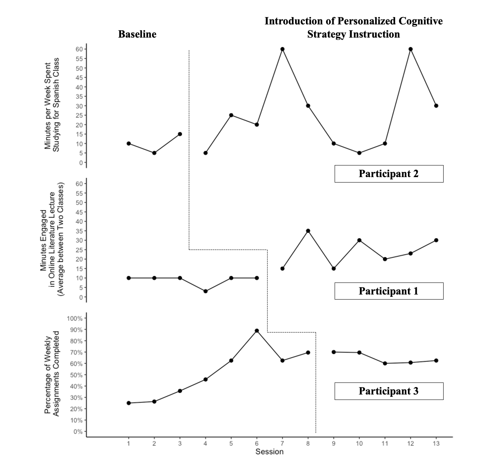

```{r setup, include=FALSE}
knitr::opts_chunk$set(echo = FALSE, warning = FALSE, message = FALSE)
```

```{r setup 1, include=FALSE}
library(tidyverse)
library(rio)
library(here)
library(gghighlight)
library(forcats)
library(ggrepel)
library(gt)
library(knitr)
library(kableExtra)
library(reactable)
library(plotly)
library(SCVA)
library(patchwork)
library(colorblindr)
library(scan)
theme_set(theme_minimal(15) +
            theme(legend.position = "bottom",
                  panel.grid.major.x = element_line(color = "gray60"),
                  panel.grid.minor.x = element_blank(),
                  panel.grid.major.y = element_blank())
          )

kahi <- import(here("data", "KAHI_status_goal.xlsx"),
               setclass = "tbl_df") 

gasy <- import(here("data", "GASY_status_goal.xlsx"),
               setclass = "tbl_df") 

gozo <- import(here("data", "GOZO_status_goal.xlsx"),
               setclass = "tbl_df") 
 
```


## Patchwork Code 

Most likely, this is the plot that will be used in the final manuscript. The plots were created individually in Rstudio with the ggplot package. They were then stacked together with the patchwork package to create one image. I intend to save this image and upload it into PowerPoint to add the dashed line between baselines and text identifiers (e.g., phases, participants).


```{r, include=FALSE}
head(kahi)

kahi_plot <- ggplot() +
  geom_line(data = kahi, aes(x = session, y = bl)) +
  geom_point(data = kahi, aes(x = session, y = bl), size = 2) +
  geom_line(data = kahi, aes(x = session, y = tx)) +
  geom_point(data = kahi, aes(x = session, y = tx), size = 2) +
  scale_x_continuous(limits = c(0, 13),
                     breaks = c(1, 2, 3, 4, 5, 6, 7, 8, 9, 10, 11, 12, 13)) +
  scale_y_continuous(limits = c(0, 60),
                     breaks = c(0, 5, 10, 15, 20, 25, 30, 35, 40, 45, 50, 55, 60)) +
  theme_classic() +
  theme(axis.title.x = element_blank(),
        axis.text.x = element_blank(),
        axis.ticks.x = element_blank(),
        axis.line.x = element_blank()) +
  labs(x = "Session",
       y = "Minutes Engaged\n in Online Literature Lecture\n (Average between Two Classes)") 

kahi_plot


gasy_plot <- ggplot() +
  geom_line(data = gasy, aes(x = session, y = bl)) +
  geom_point(data = gasy, aes(x = session, y = bl), size = 2) +
  geom_line(data = gasy, aes(x = session, y = tx)) +
  geom_point(data = gasy, aes(x = session, y = tx), size = 2) +
  scale_x_continuous(limits = c(0, 13),
                     breaks = c(1, 2, 3, 4, 5, 6, 7, 8, 9, 10, 11, 12, 13)) +
  scale_y_continuous(limits = c(0, 60),
                     breaks = c(0, 5, 10, 15, 20, 25, 30, 35, 40, 45, 50, 55, 60)) +
  theme_classic() +
  theme(axis.title.x = element_blank(),
        axis.text.x = element_blank(),
        axis.ticks.x = element_blank(),
        axis.line.x = element_blank()) +
  labs(x = "Session",
       y = "Minutes per Week Spent\n Studying for Spanish Class") 


gasy_plot


gozo_plot <- ggplot() +
  geom_line(data = gozo, aes(x = session, y = bl)) +
  geom_point(data = gozo, aes(x = session, y = bl), size = 2) +
  geom_line(data = gozo, aes(x = session, y = tx)) +
  geom_point(data = gozo, aes(x = session, y = tx), size = 2) +
  scale_x_continuous(limits = c(0, 13),
                     breaks = c(1, 2, 3, 4, 5, 6, 7, 8, 9, 10, 11, 12, 13)) +
  scale_y_continuous(limits = c(0, 100),
                     breaks = c(0, 10, 20, 30, 40, 50, 60, 70, 80, 90, 100),
                     labels = function(x) paste0(x, "%")) +
  theme_classic() +
  labs(x = "Session",
       y = "Percentage of Weekly\n Assignments Completed") 


gozo_plot


all_plots <- gasy_plot / kahi_plot / gozo_plot

all_plots
```

```{r, include=TRUE, fig.height=9, fig.width=10}
all_plots
```

**_Interpreting the Plot_**: 

The top plot represents participant 2, the middle plot represents participant 1, and the bottom plot represents participant 3. The participants are stacked in this order to adhere to the randomization of IV implementation. 

Visual Analysis characteristics to consider: 

  1. **Autocorrelation**: The results of the MLM analysis obtained a autocorrelation value of .494, suggesting moderate, positive autocorrelation. This value may affect visual analysis, specifically Type I Error, which suggests an intervention is effective when it is not. 
  2. **Baseline Stability**: As mentioned in the proposal, baseline stability was not anticipated for all participants as the delivery of psychoeducation was likely to have some effect on the status tracking measurement used for visual analysis and to determine the existence of a functional relation. Participant 2 (top plot) only obtained three baseline data points, but her final baseline data point was her highest baseline value and jumped from her lowest baseline data point during session two. This suggests her baseline phase was not stable. Participant 1 demonstrated the most consistent and stable baseline phase. Participant 3 demonstrated the strongest, positive trend during baseline phase. Although this could be a result of spending the most time in the baseline phase, participant 3's baseline data displays a gradual increase across the entire phase. 
  3. **Trend**: As discussed in the proposal, the evaluation as trend is not as critical to identifying the existence of a functional relation, due to the likelihood of baseline instability and rising baseline trend. I think the most critical aspect of trend to consider is the participant 2's obtained data during the experimental phase. Participant 2 obtained 10 experimental sessions, the longest of any participant, and her obtained data demonstrated no consistent trend during this phase. Rather, her obtained was the most volatile during this phase. Of positive not, participant 1 completed the experimental phase on a positive trend, while participant 3 maintained a stable trend throughout the experimental phase. 
  4. **Level**: One of two very important aspects of visual analysis to consider to determine the existence of a functional relation for this study. Participant 1 demonstrated the cleanest change in level between the two phases, supporting the existence of a functional relation. Although participant 2's highest data points point towards the direction of a change in level between phases, her overall volatility in the experimental phase make it challenging to point on a consistent change in level. Participant 3 demonstrates a change in level between her first four baseline data points and experimental data points. However, her last four baseline data points are near the same level as the experimental data points, suggesting a consistent change in level did not occur for this participant. 
  5. **Immediacy of Effect**: The other critical aspect of visual analysis to consider to determine the existence of a functional relation for the study. Only participant 1 demonstrated a consistent jump in performance upon the implementation of the IV to demonstrate the immediacy of effect of the IV. Participant 2 immediately decreased in her performance upon the implementation of the IV, but she then demonstrated a strong increase to reach her first peak in the experimental phase data. Therefore, participant 2 demonstrated slight immediacy of effect, but this first peak of performance was followed by a sharp decrease until the second peak occurred at the end of the study. Finally, participant 3 demonstrated no immediacy of effect following the implementation of the IV. Her experimental phase data points remained on the same level as her final four baseline data points. 


**Final Decision**: I don't think a functional relation can be determined through visual analysis. Visual analysis should be the north star of SCR analysis, and I will use the MLM and Tau-U results to provide an overarching discussion of what the data reveals. Overall, there appears to be a benefit of treatment, but within the current design and research question, it is challenging to conclude a functional relation exists between the addition of individualized cognitive strategy instruction to psychoeducation and the achievement of student RTL targets. 


## Manuscript Graph 

{width=100%}


## SCAN Demonstration {.tabset .tabset-fade .tabset-pills}

These are plots created with the SCAN package, which is a R packaged designed specifically to plot and analyze single case research data. 

```{r, include=FALSE}
case_1 <- scdf(
  values = c(A = 10, 5, 15, B = 5, 25, 20, 60, 30, 10, 5, 10, 60, 30), 
  name = "GASY"
)

case_2 <- scdf(
  values = c(A = 10, 10, 10, 3, 10, 10, B = 15, 35, 15, 30, 20, 23, 30), 
  name = "KAHI"
)

case_3 <- scdf(
  values = c(A = 25, 26.32, 35.71, 45.83, 62.5, 88.89, 62.5, 69.57, 
             B = 70, 69.57, 60, 60.71, 62.5), 
  name = "GOZO"
)

all_mbl_data <- c(case_1, case_2, case_3)
```


```{r, include=FALSE}
marks <- list(
  positions = list( c(8, 9), c(17, 19), c(7, 18) ), 
  col = 'red', cex = 2.5, pch = 1
)

plot(exampleAB, marks = marks, style = "sienna")

head(exampleAB)
exampleAB

plot(exampleAB)
plot(all_mbl_data) 
```

### Version 1

```{r, include=TRUE, fig.height=8, fig.width=10}
plot(all_mbl_data)
```

```{r, include=FALSE}
plot_style = style_plotSC(style = "chart",
                          fill = "grey50",
                          grid = "lightblue",
                          pch = 16)
plot_v2 <- plot(
  all_mbl_data,
  xlab = "session",
  ylab = "Participant Measurement",
  phase.names = c("Baseline", "Treatment"),
  ylim = c(0, 100),
  style = plot_style)
```

### Version 2

```{r, include=TRUE, fig.height=8, fig.width=10}
plot(
  all_mbl_data,
  xlab = "session",
  ylab = "Participant Measurement",
  phase.names = c("Baseline", "Treatment"),
  ylim = c(0, 100),
  style = plot_style)
```